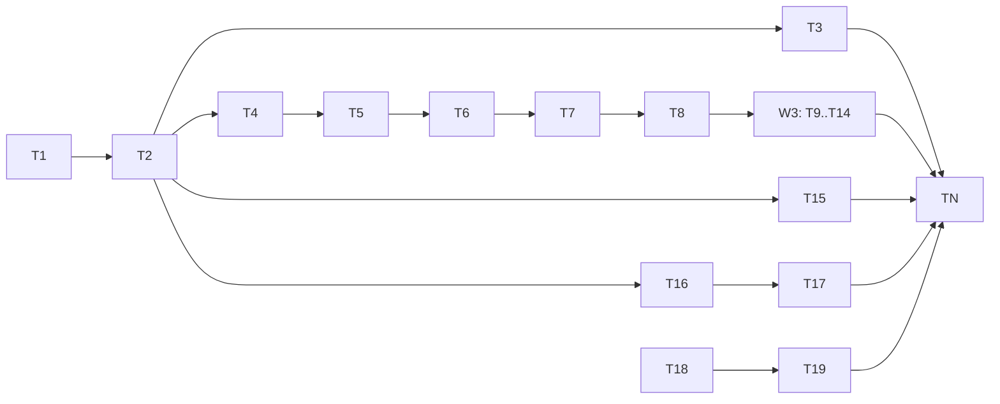

# Poker Coach — UX & Learning Overhaul — Implementation Plan

---

## Overview

Reshape the Poker Coach play screen into a no-scroll, tabbed, two-column shell; add money continuity (per-hand nets, persistent lifetime bank, bust→rebuy); mark the acting player and the winner; add Rankings and Preflop-Chart teaching tabs; and reword coaching into plain language with winner's-perspective fold narration. Built as **6 dependency-ordered, independently-shippable waves (W1→W6)**, each its own `## Phase`. The decision engine's verdict math (`core/analysis/analyze.ts`) is untouched; `HandRecord` stays schema v1.

**Done when:** at ≥1280×800 the play screen and setup show **zero vertical page scroll** (only the active tab body scrolls); stacks carry hand-to-hand with a lifetime bank that survives restart; every seat shows its per-hand net; the acting seat glows and the winner shows glow + yellow winning-5 + category banner; Rankings and Preflop-Chart tabs render (preflop grid cells are keyboard `<button>`s with aria-labels, equity from a precomputed table, no runtime LLM); no verdict leads with unexplained jargon and folds get winner narration; `npm run typecheck && npm test && npm run lint` all exit 0 with **all new + existing tests green**.

**Done-when walkthrough:** Run `npm run dev`. Playwright MCP @1280×800: load setup → `document.documentElement.scrollHeight <= window.innerHeight` (true); pick stack preset, Deal → same no-scroll assertion in-hand; only the right `#tab-body` element scrolls when you switch to a long tab. Play a hand: a non-hero seat shows the gold pulsing acting ring synced to reveal; on showdown the winning seat glows green, exactly 5 cards outline yellow, a category banner ("Two Pair, Aces & Kings") shows center-table, and every seat shows a +$/−$ net chip. The header shows Session P/L and Bank; after the hand the bank changes by hero net and persists (kill+restart `npm run dev`, GET shows the new bank). Bust the hero → rebuy modal tops up from bank; empty bank → "New table / out of chips", never a dead table. Open Preflop Chart → defaults to hero position, click `AKs` → "AK wins ~67 out of 100 vs a random hand" with plain definitions; tab through cells with the keyboard. Open Rankings → 9 categories strongest-first with plain examples. Fold a hand → Coaching narrates who won, with what, and what was sound — no invented hand when the winner mucked.

**Execution order:**

```
W1 Layout shell ─┬─> W2 Acting + showdown ─┬─> W3 Persistent bankroll
(T1 tracer, T2,  │   (T4 money, T5 helpers,│   (T8..T14)
 T3)             │    T6 view, T7 glow,    │
                 │    T8 showdown)         │
                 ├─> W4 Rankings tab (T15)            [needs only W1]
                 ├─> W5 Preflop chart (T16, T17)      [needs only W1]
                 └─> W6 Plain coaching (T18, T19)     [independent of W1; ships anytime]
TN Final verification (whole-feature sweep)
```

W1 is the tracer wave (proves the no-scroll shell). W2 must precede W3 (W3 reuses W2's per-hand net + money formatter). W4/W5 need only the W1 tab host. W6 is copy-only and independent. `[P]` after W1: W4, W5, W6 can be built in parallel with W2/W3.



---

## Decision Log

> Inherits architecture decisions S1–S8 from `02_spec.md §4` and D1–D18 from `01_requirements.md`. Entries below are implementation-specific decisions made during Phase 2 code study.

| # | Decision | Options Considered | Rationale |
|---|----------|-------------------|-----------|
| D1 | **Spec S1 override — `TableView` lacks `winners`/`isActing`/`reveal`.** Code study found `TableView` exposes only `isOver`, `isHeroTurn`, `heroNet`; `winners` lives on `HandRecord.outcome.winners`; there is no per-seat acting flag. W2 therefore adds two **pure** fields to `TableView` in `core/handFlow.ts`: `toAct: number \| null` and `winners: { seat: number; amount: number }[]`, derived from existing engine state. | (a) add minimal pure fields to `TableView` (chosen), (b) recompute winners/acting in the component from `HandRecord`, (c) halt and re-run `/spec` | (a) — keeps the single-source-of-truth in core, stays pure/unit-testable, and is additive (no engine-logic change). This is a **documented override** of S1's "purely presentational" claim — surfaced for review. |
| D2 | **Money formatter introduced as the first W2 task** (not a standalone wave), since the per-hand net chip (FR-14) is its first consumer. Each money surface adopts `formatMoney` as the wave that touches it lands; TN runs the full FR-72 sweep. | (a) one giant retrofit task, (b) adopt per-touch + verify-sweep in TN (chosen) | (b) — avoids a 1-hour mechanical retrofit task and keeps each wave's diff coherent; TN's polish sweep guarantees no surface is missed. |
| D3 | **Preflop-equity generator runs via `npx vite-node`** (ships transitively with `vitest`) plus a `gen:equity` npm script; committed `core/charts/preflopEquity.json` is the runtime source of truth. | (a) add `tsx` devDep, (b) `vite-node` (chosen), (c) compute at build | (b) — no new dependency; the repo already has the vite/vitest toolchain. Generated JSON is committed so runtime is instant + deterministic (S5). |
| D4 | **No-scroll (FR-06) is verified structurally in tests + visually via Playwright MCP**, not asserted via `scrollHeight` in unit tests. | (a) jsdom `scrollHeight` assert, (b) structural CSS-contract test + Playwright MCP (chosen) | (b) — jsdom has no layout engine, so `scrollHeight`/`innerHeight` are meaningless there. Tests assert the CSS contract (left column non-scrolling; only `#tab-body` has `overflow-y:auto`); the real pixel assertion is a Playwright MCP step in TN. |
| D5 | **`winningCards` enumerates C(n,5) combos and selects max `rank5`**; `handCategoryLabel` derives the category via `categoryOf(rank7(...))` and decodes top ranks from the winning combo for labels like "Two Pair, Aces & Kings". | (a) reuse a non-existent best-5 fn, (b) enumerate combos (chosen) | (b) — `handEval` returns only integer scores, no 5-card combo extractor exists; enumerating ≤21 combos is trivial and exact. |
| D6 | **`allHands169()` is added as a new pure helper in `core/charts/preflop.ts`** (spec FR-50 names it but it does not exist; current API is `handKey`/`chartAction`). | (a) enumerate inline in the component, (b) pure core helper (chosen) | (b) — keeps grid enumeration testable + reusable by the generator and the tab; consistent with core purity. |

---

## Code Study Notes

> Glossary inherited from `02_spec.md` and `01_requirements.md`. No new domain terms introduced.

### Patterns to follow

- `app/api/hands/route.ts` — Next route handler shape: `export async function POST(req: Request)` → parse JSON → validate → `NextResponse.json({...}, { status })`. Mirror for `app/api/bankroll/route.ts` GET/PUT.
- `lib/dataStore.ts:25-30` — `writeAtomic(file, contents)` = `mkdir -p` + write `${file}.tmp` + `fs.rename`. Reuse for `saveBankroll`; mirror its `getDataDir()` root default.
- `core/handFlow.test.ts` — unit-test style: `import { describe, it, expect } from "vitest"`, `@/`-alias imports, `globals: true`, `jsdom` env. Mirror for all new `core/*` tests.
- `core/eval/handEval.ts:5-15,42-115` — `HandCategory` enum (HighCard=0..StraightFlush=8), `rank5`/`rank7`/`categoryOf`. Build new label/best-5 helpers on top.
- `components/table/Seat.tsx`, `CenterStack.tsx`, `Card.tsx` — presentational table parts reading `TableSeatView`/`ReplaySnapshot`; extend for glow/net/highlight/banner.
- `core/charts/preflop.ts` — `handKey([c,c])`, `chartAction([c,c],pos,facing)`, `Position`/`Facing`/`ChartAction` types; data from `preflopCharts.json` (`open`/`vsOpen`).

### Existing code to reuse

- `core/equity/equity.ts` — `equity({ hero, board:[], numOpponents:1, iterations, seed }): EquityResult` (`.equityPct`); used by the precompute generator (T16) and the missing-key fallback (T17).
- `core/equity/equityClient.ts` — `requestEquity(req, makeWorker)` async/off-thread; fallback path reference.
- `store/sessionStore.ts` — settings + `startSession`; extend with `displayUnit` + `activeTab` (ephemeral, FR-04/71/S7).
- `store/gameStore.ts` — `configure`/`newHand`/`feedback`/`tick`; hand-end detection point for the bankroll write (T11). Currently hardcodes stack:200 / startingStackBb:100 in seat build + newHand → seeded from bankroll in T12.
- `core/history/handRecord.ts:50-78` — `OutcomeRecord { winners[], heroNet, shown[], endedAtShowdown }`, `HandRecord`; `HANDRECORD_SCHEMA_VERSION = 1` (UNTOUCHED).
- `components/FeedbackPanel.tsx`, `CoachingViewer.tsx`, `HandRecap.tsx` — moved into tabs in W1 with no behavior change.

### Constraints discovered

- **`TableView` has no `winners`/acting/`reveal` fields** — see D1; W2 adds `toAct` + `winners` (pure) to `core/handFlow.ts`. Treat as the riskiest integration point of W2.
- **No `scripts/` dir, no `tsx`/`ts-node`** — generator runs via `npx vite-node` + a `gen:equity` script (D3).
- **No Playwright dependency** (only the MCP tool) — no automated e2e; no-scroll is structural-test + MCP-verified (D4).
- **`handEval` exposes only integer scores**, no 5-card combo extractor — `winningCards` enumerates combos (D5).
- **`preflop.ts` has no `allHands169`/`canonicalHand`** — add `allHands169()` (D6); the 169-key canonical form is what `handKey` already produces.
- `core/cards.ts` — `Card = `${Rank}${Suit}`` template-literal type; `Rank`/`Suit` unions. New helpers type against this.
- `next`/`react`/`zustand` only runtime deps; tests via `vitest` + `@testing-library/react` + `jsdom`.

### Stack signals

- **Stack: Next.js 14 + React 18 + TypeScript + Zustand**, tested with **Vitest (jsdom) + React Testing Library**. Signals: `package.json` (`next dev`/`build`/`start`, `vitest run`, `tsc --noEmit`, `eslint . --ext .ts,.tsx`), `@/` path alias via `vitest.config.ts`/`tsconfig`. No Docker, no DB, no other lockfile ambiguity. Reference system for FS-IO + route shape: the existing `app/api/hands` + `lib/dataStore` pair.

---

## Prerequisites

- `npm install` done; `node_modules` present (symlinked from `../poker-coach` in this worktree).
- Dev server runnable: `npm run dev` → http://localhost:3000.
- Branch `feat/ux-learning-overhaul` checked out in this worktree.
- Baseline green: `npm run typecheck && npm test && npm run lint` all pass before T1.

---

## File Map

> Tasks are source of truth; this indexes their **Files:** sections.

| Action | File | Responsibility | Task |
|--------|------|---------------|------|
| Modify | `app/globals.css` | `html,body` height/overflow; tokens for glows/nets; reduced-motion | T1 |
| Modify | `app/page.tsx` | no-scroll 100vh flex shell; 2-col grid; mount RightPanel | T1, T2 |
| Create | `components/RightPanel.tsx` | tabbed right column; only `#tab-body` scrolls | T2 |
| Create | `components/TabStrip.tsx` | pinned tab buttons; active state | T2 |
| Modify | `store/sessionStore.ts` | `activeTab` (T2) + `displayUnit` (T4) | T2, T4 |
| Modify | `components/SetupScreen.tsx` | no-scroll reflow; stack-preset chips as `<button>` | T3, T13 |
| Create | `core/money.ts` | pure `formatMoney(dollars, unit, bigBlind)` | T4 |
| Create | `core/money.test.ts` | money formatter tests | T4 |
| Modify | `core/eval/handEval.ts` | `handCategoryLabel`, `winningCards` (pure) | T5 |
| Modify | `core/eval/handEval.test.ts` | tests for label + best-5 | T5 |
| Modify | `core/handFlow.ts` | add `toAct` + `winners` to `TableView` (pure) | T6 |
| Modify | `core/handFlow.test.ts` | assert new fields | T6 |
| Modify | `components/table/Seat.tsx` | acting glow, winner glow, net chip, $⇄BB hero toggle | T7, T8, T4 |
| Modify | `components/table/Card.tsx` | yellow winning-card outline | T8 |
| Modify | `components/table/CenterStack.tsx` | category banner near pot | T8 |
| Create | `core/bankroll.ts` | pure reducer (default/applyHandResult/rebuy/newTable) | T9 |
| Create | `core/bankroll.test.ts` | reducer tests | T9 |
| Modify | `lib/dataStore.ts` | `saveBankroll`/`loadBankroll` + `BANKROLL_SCHEMA_VERSION` | T10 |
| Modify | `lib/dataStore.test.ts` | round-trip + corrupt-file tests | T10 |
| Create | `app/api/bankroll/route.ts` | GET/PUT bankroll | T11 |
| Create | `app/api/bankroll/route.test.ts` | route integration tests | T11 |
| Create | `store/bankrollStore.ts` | load/save/transitions store | T12 |
| Modify | `store/gameStore.ts` | seed stacks from bankroll; bots auto-rebuy; call bankroll at hand-end | T12, T13 |
| Create | `components/HeaderBar.tsx` | Session P/L + Bank + New table/hand | T14 |
| Create | `components/RebuyModal.tsx` | bust→rebuy + auto-rebuy toggle + empty-bank end state | T14 |
| Create | `components/RankingsTab.tsx` | 9 categories strongest-first from enum | T15 |
| Modify | `core/charts/preflop.ts` | `allHands169()` pure helper | T16 |
| Create | `scripts/genPreflopEquity.ts` | generator for the equity table | T16 |
| Create | `core/charts/preflopEquity.json` | committed precomputed equity (generated) | T16 |
| Create | `components/PreflopChartTab.tsx` | 13×13 `<button>` grid + selector + detail card | T17 |
| Modify | `core/analysis/explain.ts` | reword verdicts; winner-narration builder | T18, T19 |
| Modify | `core/analysis/explain.test.ts` | no-jargon + narration tests | T18, T19 |
| Modify | `.claude/skills/poker-coach/SKILL.md` | winner's-perspective narration guidance | T19 |
| Modify | `package.json` | `gen:equity` script | T16 |

---

## Risks

| # | Risk | Likelihood | Impact | Severity | Mitigation | Mitigation in: |
|---|------|-----------|--------|----------|------------|----------------|
| R1 | Adding `toAct`/`winners` to `TableView` breaks existing handFlow consumers/tests | Medium | Medium | Medium | Additive fields only; build green-first against existing `handFlow.test.ts`; run full suite | T6 |
| R2 | Bankroll write at hand-end races the next hand / partial write | Medium | Medium | Medium | Pure reducer + atomic temp-rename; await save before `newHand`; last-write-wins | T10, T12 |
| R3 | Equity generator slow or non-deterministic across runs | Medium | Low | Low | Fixed `seed` + `iterations`; commit output JSON; runtime fallback for missing keys | T16, T17 |
| R4 | No-scroll regresses as tab content grows | Medium | High | High | Only `#tab-body` scrolls; structural CSS-contract test + Playwright MCP @1280×800 | T1, T17, TN |
| R5 | Money formatter not adopted on every surface (FR-72 miss) | Medium | Low | Low | Per-touch adoption + explicit FR-72 sweep in TN | T4, TN |

---

## Rollback

- Wave-by-wave `git revert` (each `## Phase` is an independently green merge).
- `data/bankroll.json` is additive — deleting it yields a fresh default (FR-30); no destructive migration.
- `core/charts/preflopEquity.json` is generated + committed — revert the file; runtime falls back to on-demand compute.
- `HandRecord` untouched (schema v1) — older records still render.

---

## Tasks

## Phase 1: W1 — Layout shell (tracer wave)

[Phase rationale: prove the no-scroll, 2-column, tabbed architecture end-to-end with the existing panels before adding any new behavior. Demoable: at ≥1280×800 the play screen and setup show zero page scroll; only the active tab body scrolls; existing Feedback/Coaching/Hands content lives in tabs. Riskiest unproven point — the `100vh` flex + single-scroll-region contract — is inside T1.]

### T1: No-scroll 2-column shell (tracer bullet)

**Goal:** The play screen fills exactly one viewport at ≥1280×800 with no page scroll; the left column (table area) never scrolls.
**Spec refs:** FR-01, FR-02, FR-03 (partial), FR-06 (partial), NFR-01
**Wireframe refs:** `wireframes/02_play-screen_desktop-web.html` (no-scroll shell, left/right split)
**Depends on:** none
**Idempotent:** yes
**TDD:** yes — new-feature
**Slice shape:** vertical — CSS shell + page structure + a structural contract test, end-to-end through the play screen.

**Files:**
- Modify: `app/globals.css`
- Modify: `app/page.tsx`
- Create: `app/page.noscroll.test.tsx`

**Steps:**

- [ ] Step 1 — Write the failing structural test. The no-scroll *pixel* contract can't be measured in jsdom (D4); instead assert the CSS contract: the play shell root carries `height:100vh`/`overflow:hidden` and the left column is not a scroll container.
  ```tsx
  // app/page.noscroll.test.tsx
  import { describe, it, expect } from "vitest";
  import { render } from "@testing-library/react";
  import Page from "@/app/page";
  // helper: enter play phase by configuring + dealing via the exported stores,
  // or render the extracted <PlayShell> directly (see Step 3).
  describe("play shell no-scroll contract", () => {
    it("root fills the viewport and hides overflow", () => {
      const { container } = render(<PlayShellForTest />);
      const root = container.querySelector('[data-testid="play-shell"]') as HTMLElement;
      expect(root).toBeTruthy();
      expect(root.style.height).toBe("100vh");
      expect(root.style.overflow).toBe("hidden");
    });
    it("left column is not a scroll region", () => {
      const { container } = render(<PlayShellForTest />);
      const left = container.querySelector('[data-testid="left-col"]') as HTMLElement;
      expect(left.style.overflowY === "" || left.style.overflowY === "hidden").toBe(true);
    });
  });
  ```
- [ ] Step 2 — Run it, expect FAIL (no `data-testid="play-shell"` yet).
  Run: `npm test -- app/page.noscroll.test.tsx`
  Expected: FAIL (element not found).
- [ ] Step 3 — Implement the shell. In `app/globals.css` add `html, body { height: 100%; overflow: hidden; }`. In `app/page.tsx`, replace the play-phase `<main style={{ maxWidth: 1000, margin: "0 auto" }}>` wrapper with a `100vh` flex-column shell, and lay the body out as a 2-column grid. Extract the play markup into a `PlayShell` (so the test can render it without driving setup). Keep the existing children mounted; CoachingViewer moves into the right column in T2 (for T1 it may stay in the right column placeholder).
  ```tsx
  // app/page.tsx (play phase)
  <div data-testid="play-shell" style={{ height: "100vh", overflow: "hidden", display: "flex", flexDirection: "column" }}>
    <header style={{ flex: "0 0 auto", /* existing header content */ }}>…</header>
    <div style={{ flex: 1, minHeight: 0, display: "grid", gridTemplateColumns: "1fr 420px", gap: 16 }}>
      <div data-testid="left-col" style={{ minHeight: 0, display: "flex", flexDirection: "column", overflow: "hidden" }}>
        <PokerTable />
      </div>
      <div data-testid="right-col" style={{ minHeight: 0, overflow: "hidden" }}>
        {/* RightPanel arrives in T2; for T1, FeedbackPanel + CoachingViewer live here */}
      </div>
    </div>
  </div>
  ```
- [ ] Step 4 — Run the test, expect PASS.
  Run: `npm test -- app/page.noscroll.test.tsx`
  Expected: PASS (2 tests).
- [ ] Step 5 — Commit.
  ```bash
  git add app/globals.css app/page.tsx app/page.noscroll.test.tsx
  git commit -m "feat(T1): no-scroll 2-column play shell"
  ```

**T0 (Prerequisite Check):**
- [ ] `npm run typecheck` exits 0.
- [ ] Dev server runs: `npm run dev` serves http://localhost:3000.

**Inline verification:**
- `npm test -- app/page.noscroll.test.tsx` — 2 passed.
- `npm run typecheck` — 0 errors.
- Playwright MCP (manual, see env note): navigate http://localhost:3000, deal a hand, assert `document.documentElement.scrollHeight <= window.innerHeight` at 1280×800.

### T2: Tabbed right panel (TabStrip + RightPanel; only tab body scrolls)

**Goal:** The right column becomes a tab host (Feedback / Coaching / Hands / Rankings / Preflop Chart); only the tab body scrolls; existing panels move into tabs unchanged.
**Spec refs:** FR-03, FR-04, FR-07
**Wireframe refs:** `wireframes/02_play-screen_desktop-web.html` (5 tabs, pinned strip)
**Depends on:** T1
**Idempotent:** yes
**TDD:** yes — new-feature
**Slice shape:** vertical — store state + tab UI + content migration, end-to-end.

**Files:**
- Create: `components/TabStrip.tsx`
- Create: `components/RightPanel.tsx`
- Create: `components/RightPanel.test.tsx`
- Modify: `store/sessionStore.ts`
- Modify: `app/page.tsx`

**Steps:**

- [ ] Step 1 — Add `activeTab` to `sessionStore`. Extend the state with `activeTab: TabKey` (`type TabKey = "feedback"|"coaching"|"hands"|"rankings"|"preflop"`), default `"feedback"`, and `setActiveTab(tab: TabKey)`. (Ephemeral, not persisted — S7.)
- [ ] Step 2 — Write the failing test for RightPanel.
  ```tsx
  // components/RightPanel.test.tsx
  import { describe, it, expect } from "vitest";
  import { render, screen, fireEvent } from "@testing-library/react";
  import { RightPanel } from "@/components/RightPanel";
  describe("RightPanel", () => {
    it("shows Feedback by default and only the tab body scrolls", () => {
      const { container } = render(<RightPanel />);
      const body = container.querySelector('[data-testid="tab-body"]') as HTMLElement;
      expect(body.style.overflowY).toBe("auto");
      expect(screen.getByRole("tab", { name: /feedback/i })).toHaveAttribute("aria-selected", "true");
    });
    it("switches tabs on click", () => {
      render(<RightPanel />);
      fireEvent.click(screen.getByRole("tab", { name: /rankings/i }));
      expect(screen.getByRole("tab", { name: /rankings/i })).toHaveAttribute("aria-selected", "true");
    });
  });
  ```
- [ ] Step 3 — Run, expect FAIL (no RightPanel).
  Run: `npm test -- components/RightPanel.test.tsx` → FAIL.
- [ ] Step 4 — Implement `TabStrip` (role="tablist", each tab a `<button role="tab" aria-selected>`), and `RightPanel` (`flex column`; `TabStrip` `flex:0 0 auto`; `#tab-body` `data-testid="tab-body"` `flex:1; min-height:0; overflow-y:auto`). Body renders by `activeTab`: `feedback`→`<FeedbackPanel …>`, `coaching`→`<CoachingViewer …>`, `hands`→`<HandRecap …>` (move existing usages here verbatim), `rankings`/`preflop`→placeholder "Coming soon" (filled in W4/W5). Mount `<RightPanel/>` in `app/page.tsx`'s `right-col`; remove the old below-grid `CoachingViewer`.
- [ ] Step 5 — Run, expect PASS.
  Run: `npm test -- components/RightPanel.test.tsx` → PASS.
- [ ] Step 6 — Commit.
  ```bash
  git add components/TabStrip.tsx components/RightPanel.tsx components/RightPanel.test.tsx store/sessionStore.ts app/page.tsx
  git commit -m "feat(T2): tabbed right panel; only tab body scrolls"
  ```

**Inline verification:**
- `npm test -- components/RightPanel.test.tsx store/store.test.ts` — all passed.
- `npm run typecheck` — 0 errors.
- Manual: switch tabs; table stays fixed; only the tab body scrolls on a long tab.

### T3: Setup screen no-scroll reflow

**Goal:** The setup screen fits one fold at ≥1280×800 with no page scroll.
**Spec refs:** FR-05, FR-06, NFR-01
**Wireframe refs:** `wireframes/01_setup_desktop-web.html`
**Depends on:** T2
**Idempotent:** yes
**TDD:** no — css-only (layout reflow of an existing component; behavior unchanged)
**Slice shape:** css-only — reflows `SetupScreen` to fit the fold; no new behavior, so no red/green test (verified via the structural shell test + Playwright).

**Files:**
- Modify: `components/SetupScreen.tsx`
- Modify: `app/globals.css` (only if shared setup layout rules are needed)

**Steps:**

- [ ] Step 1 — Wrap the setup body in a `height:100vh; overflow:hidden; display:flex; flex-direction:column` container; convert the vertical stack into a denser 2-column or grid arrangement (opponents/depth on the left, stack-preset + bank summary on the right) per the wireframe so it fits 800px tall.
- [ ] Step 2 — Verify existing `SetupScreen.test.tsx` still passes (no behavior change).
  Run: `npm test -- components/SetupScreen.test.tsx`
  Expected: PASS (unchanged).
- [ ] Step 3 — Commit.
  ```bash
  git add components/SetupScreen.tsx app/globals.css
  git commit -m "feat(T3): setup screen no-scroll reflow @1280x800"
  ```

**Inline verification:**
- `npm test -- components/SetupScreen.test.tsx` — passed (unchanged behavior).
- Playwright MCP @1280×800: setup page `scrollHeight <= innerHeight`.

**Phase 1 boundary:** run full `/verify`-style gate — `npm run typecheck && npm test && npm run lint` all green; Playwright MCP no-scroll on setup + in-hand. W1 is independently shippable here.

---

## Phase 2: W2 — Money formatter + acting/showdown marking

[Phase rationale: make the table readable — whose turn it is, who won, with what, and each seat's net — plus the cross-cutting money formatter that the net chip is the first consumer of. Demoable: the acting seat glows synced to reveal; at showdown the winner glows, the winning 5 cards highlight yellow, a category banner shows, and every seat shows its net; the hero stack toggles $⇄BB. Riskiest unproven point — exposing `toAct`/`winners` on `TableView` (D1) — is in T6, the first non-presentational task.]

### T4: Pure money formatter + `displayUnit` ($⇄BB)

**Goal:** A pure `formatMoney` and a `displayUnit` flag, with the hero stack toggling units.
**Spec refs:** FR-70, FR-71, FR-72 (introduce; full sweep in TN), NFR-02, NFR-05
**Depends on:** T2
**Idempotent:** yes
**TDD:** yes — new-feature
**Slice shape:** vertical — pure formatter + store flag + a first real consumer (hero stack toggle).

**Files:**
- Create: `core/money.ts`
- Create: `core/money.test.ts`
- Modify: `store/sessionStore.ts`
- Modify: `components/table/Seat.tsx`

**Steps:**

- [ ] Step 1 — Write failing tests for `formatMoney`.
  ```ts
  // core/money.test.ts
  import { describe, it, expect } from "vitest";
  import { formatMoney } from "@/core/money";
  describe("formatMoney", () => {
    it("formats usd as whole dollars", () => {
      expect(formatMoney(20, "usd", 2)).toBe("$20");
      expect(formatMoney(0, "usd", 2)).toBe("$0");
      expect(formatMoney(-15, "usd", 2)).toBe("-$15");
    });
    it("formats bb as multiples of the big blind, ≤1 decimal", () => {
      expect(formatMoney(20, "bb", 2)).toBe("10 BB");
      expect(formatMoney(3, "bb", 2)).toBe("1.5 BB");
      expect(formatMoney(5, "bb", 2)).toBe("2.5 BB"); // E8: ≤1 decimal
    });
    it("guards a zero/invalid big blind in bb mode", () => {
      expect(() => formatMoney(20, "bb", 0)).not.toThrow();
    });
  });
  ```
- [ ] Step 2 — Run, expect FAIL.
  Run: `npm test -- core/money.test.ts` → FAIL.
- [ ] Step 3 — Implement `core/money.ts` (pure; no imports from app/components/store). Signature: `export type MoneyUnit = "usd" | "bb"; export function formatMoney(dollars: number, unit: MoneyUnit, bigBlind: number): string`. `usd` → `${neg}$${Math.round(abs)}`; `bb` → divide by `bigBlind`, round to ≤1 decimal (strip trailing `.0`), append ` BB`; if `bigBlind <= 0` fall back to usd.
- [ ] Step 4 — Run, expect PASS.
  Run: `npm test -- core/money.test.ts` → PASS.
- [ ] Step 5 — Add `displayUnit: MoneyUnit` (default `"usd"`) + `toggleDisplayUnit()` to `sessionStore`. In `Seat.tsx`, render the hero's own stack as a `<button aria-label="Toggle dollars / big blinds">` that calls `toggleDisplayUnit`; format the hero stack via `formatMoney(stack, displayUnit, bigBlind)`. (Other seats/amounts adopt `formatMoney` in their own tasks; TN sweeps FR-72.)
- [ ] Step 6 — Commit.
  ```bash
  git add core/money.ts core/money.test.ts store/sessionStore.ts components/table/Seat.tsx
  git commit -m "feat(T4): pure formatMoney + displayUnit $/BB toggle"
  ```

**Inline verification:**
- `npm test -- core/money.test.ts` — passed.
- `npm run typecheck` — 0 errors; assert no React/DOM import in `core/money.ts` (`! grep -E "react|next|@/components|@/store" core/money.ts`).
- Manual: click hero stack → toggles $ ⇄ BB.

### T5: Pure `handCategoryLabel` + `winningCards` helpers

**Goal:** Pure helpers that name the made hand and return its exact 5 cards.
**Spec refs:** FR-11, FR-12, S2, NFR-02
**Depends on:** T2
**Idempotent:** yes
**TDD:** yes — new-feature
**Slice shape:** refactor-prep — pure core helpers consumed by T8's showdown UI; no end-to-end behavior on their own.

**Files:**
- Modify: `core/eval/handEval.ts`
- Modify: `core/eval/handEval.test.ts`

**Steps:**

- [ ] Step 1 — Write failing tests.
  ```ts
  // core/eval/handEval.test.ts (append)
  import { handCategoryLabel, winningCards } from "@/core/eval/handEval";
  describe("handCategoryLabel", () => {
    it("names two pair with both ranks", () => {
      expect(handCategoryLabel(["Ah","Ad","Kh","Kd","2c","7s","9h"])).toBe("Two Pair, Aces & Kings");
    });
    it("names a flush, straight, full house, quads, straight flush", () => {
      expect(handCategoryLabel(["2h","5h","9h","Jh","Kh","3c","4d"])).toMatch(/^Flush/);
      expect(handCategoryLabel(["5c","6d","7h","8s","9c","2h","2d"])).toMatch(/^Straight/);
    });
  });
  describe("winningCards", () => {
    it("returns exactly the best 5 cards", () => {
      const five = winningCards(["Ah","Ad"], ["Kh","Kd","2c","7s","9h"]);
      expect(five).toHaveLength(5);
      expect(new Set(five)).toEqual(new Set(["Ah","Ad","Kh","Kd","9h"]));
    });
    it("handles the wheel (A-2-3-4-5)", () => {
      const five = winningCards(["Ah","2d"], ["3c","4s","5h","Kd","Qc"]);
      expect(new Set(five)).toEqual(new Set(["Ah","2d","3c","4s","5h"]));
    });
  });
  ```
- [ ] Step 2 — Run, expect FAIL.
  Run: `npm test -- core/eval/handEval.test.ts` → FAIL.
- [ ] Step 3 — Implement in `handEval.ts` (pure). `winningCards(hole, board)`: concat → enumerate all C(n,5) combos → pick the combo with max `rank5` → return those 5 `Card`s. `handCategoryLabel(cards)`: `const best = cards.length === 5 ? cards : winningCards over the set`; `cat = categoryOf(rank5(best))`; map to a plain label, decoding the relevant top ranks (pair/two-pair/trips/quads include rank names via a `rankWord(rank): string` helper, e.g. "Aces", "Kings"). Cover all 9 categories.
- [ ] Step 4 — Run, expect PASS.
  Run: `npm test -- core/eval/handEval.test.ts` → PASS.
- [ ] Step 5 — Commit.
  ```bash
  git add core/eval/handEval.ts core/eval/handEval.test.ts
  git commit -m "feat(T5): pure handCategoryLabel + winningCards"
  ```

**Inline verification:**
- `npm test -- core/eval/handEval.test.ts` — passed (incl. existing).
- `npm run typecheck` — 0 errors; `core/eval/handEval.ts` stays pure.

### T6: Expose `toAct` + `winners` on `TableView` (pure; D1)

**Goal:** `TableView` carries which seat must act and, when over, the winners — derived in core, no engine-logic change.
**Spec refs:** FR-10 (data), FR-13/14/16 (data), S1 (override per D1)
**Depends on:** T5
**Idempotent:** yes
**TDD:** yes — new-feature
**Slice shape:** refactor-prep — additive view fields the W2 UI tasks consume; addresses R1.

**Files:**
- Modify: `core/handFlow.ts`
- Modify: `core/handFlow.test.ts`

**Steps:**

- [ ] Step 1 — Write failing tests asserting the new fields.
  ```ts
  // core/handFlow.test.ts (append)
  it("exposes toAct (acting seat) while the hand is live and null when over", () => {
    const flow = startHand({ /* same fixture as existing tests */ });
    const v = flow.tableView();
    if (!v.isOver) expect(typeof v.toAct === "number" || v.toAct === null).toBe(true);
  });
  it("exposes winners[] matching the outcome when the hand is over", () => {
    const flow = startHand({ /* fixture */ });
    // drive flow to completion (mirror existing 'plays out' test)
    const v = flow.tableView();
    if (v.isOver) {
      expect(Array.isArray(v.winners)).toBe(true);
      const rec = flow.toRecord();
      expect(v.winners).toEqual(rec.outcome.winners);
    }
  });
  ```
- [ ] Step 2 — Run, expect FAIL.
  Run: `npm test -- core/handFlow.test.ts` → FAIL.
- [ ] Step 3 — Implement. Extend `TableView` with `toAct: number | null` and `winners: { seat: number; amount: number }[]`. In `tableView()`: set `toAct` to the engine's current actor seat when the hand is live (the same source `isHeroTurn` is derived from — generalized to any seat), else `null`; set `winners` from the engine result (the same data `toRecord()` writes to `outcome.winners`) when `isOver`, else `[]`. No change to action processing, reveal, or record serialization.
- [ ] Step 4 — Run, expect PASS; run the WHOLE suite to prove no regression (R1).
  Run: `npm test -- core/handFlow.test.ts` then `npm test` → all PASS.
- [ ] Step 5 — Commit.
  ```bash
  git add core/handFlow.ts core/handFlow.test.ts
  git commit -m "feat(T6): expose toAct + winners on TableView (pure)"
  ```

**Inline verification:**
- `npm test` — full suite green (regression guard for R1).
- `npm run typecheck` — 0 errors; `core/handFlow.ts` imports no React/DOM.

### T7: Acting-player "thinking" glow

**Goal:** The seat to act shows a pulsing gold glow, synced to reveal, honoring reduced motion.
**Spec refs:** FR-10, NFR-05, §11.3
**Wireframe refs:** `wireframes/02_play-screen_desktop-web.html` (acting glow state)
**Depends on:** T6
**Idempotent:** yes
**TDD:** yes — new-feature
**Slice shape:** vertical — view field → seat rendering → visible glow.

**Files:**
- Modify: `components/table/Seat.tsx`
- Modify: `components/table/PokerTable.tsx` (pass `toAct` to seats)
- Modify: `app/globals.css` (`.acting-glow` + `@keyframes pulse` + reduced-motion)
- Create: `components/table/Seat.test.tsx` (if absent) or extend a table test

**Steps:**

- [ ] Step 1 — Write failing test: a seat whose `seat === toAct` gets the `acting-glow` class.
  ```tsx
  import { render } from "@testing-library/react";
  import { Seat } from "@/components/table/Seat";
  it("applies acting-glow to the seat to act", () => {
    const seat = { seat: 3, name: "Bot", isHero: false, position: "CO", stack: 100, folded: false, isButton: false, cards: null } as any;
    const { container } = render(<Seat seat={seat} isActing />);
    expect(container.querySelector(".acting-glow")).toBeTruthy();
  });
  ```
- [ ] Step 2 — Run, expect FAIL.
  Run: `npm test -- components/table/Seat.test.tsx` → FAIL.
- [ ] Step 3 — Add an `isActing?: boolean` prop to `Seat`; apply `acting-glow` when true. In `PokerTable`, read `tableView().toAct` and pass `isActing={seat.seat === toAct}`. Add `.acting-glow` + `@keyframes pulse` to `globals.css` (gold ring per wireframe), wrapped so `@media (prefers-reduced-motion: reduce) { .acting-glow { animation: none } }`.
- [ ] Step 4 — Run, expect PASS.
  Run: `npm test -- components/table/Seat.test.tsx` → PASS.
- [ ] Step 5 — Commit.
  ```bash
  git add components/table/Seat.tsx components/table/PokerTable.tsx app/globals.css components/table/Seat.test.tsx
  git commit -m "feat(T7): acting-player thinking glow (reduced-motion aware)"
  ```

**Inline verification:**
- `npm test -- components/table/Seat.test.tsx` — passed.
- Manual: deal a hand; the bot to act glows, advancing seat to seat with the reveal.

### T8: Showdown layer — winner glow + winning cards + banner + net chips

**Goal:** At hand end, mark the winner(s) with a glow, outline the winning 5 cards yellow, show a category banner near the pot, and a per-hand net chip on every seat — incl. fold-out and split-pot cases.
**Spec refs:** FR-13, FR-14, FR-15, FR-16, E4, E5, §11.3
**Wireframe refs:** `wireframes/02_play-screen_desktop-web.html` (showdown state)
**Depends on:** T5, T6, T7
**Idempotent:** yes
**TDD:** yes — new-feature
**Slice shape:** vertical — view data → table/seat/card/center rendering → visible showdown.

**Files:**
- Modify: `components/table/Seat.tsx` (winner glow + net chip via `formatMoney`)
- Modify: `components/table/Card.tsx` (yellow outline when `highlighted`)
- Modify: `components/table/CenterStack.tsx` (category banner)
- Modify: `components/table/PokerTable.tsx` (compute winner set, winning cards, per-seat net)
- Modify: `components/table/CenterStack.test.tsx` (+ banner)

**Steps:**

- [ ] Step 1 — Write failing tests: (a) `CenterStack` shows the category banner when given a label; (b) a `Seat` with `isWinner` gets `winner-glow`; (c) a net chip renders `+$X`/`-$X` (formatted via `formatMoney`); (d) `Card` with `highlighted` gets the `card-hi` class.
  ```tsx
  it("shows the hand-category banner at showdown", () => {
    const { getByText } = render(<CenterStack snapshot={snap as any} categoryBanner="Two Pair, Aces & Kings" />);
    expect(getByText("Two Pair, Aces & Kings")).toBeTruthy();
  });
  it("marks winner seat and net chip", () => {
    const { container, getByText } = render(<Seat seat={seat as any} isWinner net={120} bigBlind={2} />);
    expect(container.querySelector(".winner-glow")).toBeTruthy();
    expect(getByText(/\+\$120/)).toBeTruthy();
  });
  ```
- [ ] Step 2 — Run, expect FAIL.
  Run: `npm test -- components/table/CenterStack.test.tsx components/table/Seat.test.tsx` → FAIL.
- [ ] Step 3 — Implement. In `PokerTable`, when `tableView().isOver`: build a `Set` of winner seats from `winners`; compute each seat's per-hand net (winner share minus committed — derive from `winners[].amount` and `heroNet`/contributions available in the view; for non-hero seats use `winners` amount minus their committed from the snapshot). For the showdown winner, compute `winningCards(holeForWinner, board)` (hole from `TableSeatView.cards` when shown) and pass `highlighted` to the matching `Card`s; compute the banner via `handCategoryLabel`. Pass `isWinner`, `net`, `bigBlind`, `displayUnit` to `Seat`; `categoryBanner` to `CenterStack`. **FR-15 fold-out:** when `!endedAtShowdown`/no shown cards → mark winner + net only, **no banner, no card highlight**. **FR-16 split:** multiple `isWinner` seats, each its own net. Add `.winner-glow`, `.card-hi` (yellow outline), `.netchip`/`.net-pos`/`.net-neg` to `globals.css`.
- [ ] Step 4 — Run, expect PASS.
  Run: `npm test -- components/table/CenterStack.test.tsx components/table/Seat.test.tsx` → PASS.
- [ ] Step 5 — Commit.
  ```bash
  git add components/table app/globals.css
  git commit -m "feat(T8): showdown layer — winner glow, winning cards, banner, net chips"
  ```

**Inline verification:**
- `npm test -- components/table` — all passed.
- Manual: play to showdown → green winner glow + yellow winning 5 + center banner + per-seat nets; fold a hand pre-showdown → winner + nets only (no banner/highlight); force a chopped pot → two glows.

**Phase 2 boundary:** full gate green; Playwright MCP: play a hand to showdown and verify acting glow, winner glow, yellow cards, banner, nets; toggle $⇄BB. W2 independently shippable.

---

## Phase 3: W3 — Persistent bankroll

[Phase rationale: money continuity — stacks carry hand-to-hand, a lifetime bank persists to disk and survives restart, bust→rebuy keeps the table alive, and the header shows Session P/L + Bank. Demoable: play several hands, watch the bank move and persist across a server restart; bust the hero and rebuy from the bank; "New table" resets stacks but keeps the bank. Riskiest unproven point — the write→read persistence chain — is built bottom-up: pure reducer (T9) → FS IO (T10) → route (T11) → store wiring (T12).]

### T9: Pure bankroll reducer + types

**Goal:** A pure, unit-tested reducer for all bankroll transitions.
**Spec refs:** FR-20, FR-31, S3, S8, NFR-02
**Depends on:** T8
**Idempotent:** yes
**TDD:** yes — new-feature
**Slice shape:** refactor-prep — pure reducer consumed by the store; no IO.

**Files:**
- Create: `core/bankroll.ts`
- Create: `core/bankroll.test.ts`

**Steps:**

- [ ] Step 1 — Write failing tests for the reducer.
  ```ts
  // core/bankroll.test.ts
  import { describe, it, expect } from "vitest";
  import { defaultBankroll, applyHandResult, rebuy, newTable, BANKROLL_SCHEMA_VERSION } from "@/core/bankroll";
  describe("bankroll reducer", () => {
    it("builds a fresh default", () => {
      const b = defaultBankroll(200, 6);
      expect(b.schemaVersion).toBe(BANKROLL_SCHEMA_VERSION);
      expect(b.bank).toBeGreaterThan(0);
      expect(b.startingStack).toBe(200);
      expect(b.seats).toHaveLength(6);
      expect(b.sessionPnl).toBe(0);
    });
    it("applies a hand result: hero net moves bank + sessionPnl + hero stack", () => {
      const b0 = defaultBankroll(200, 2);
      const b1 = applyHandResult(b0, { heroSeat: 0, net: 50, seatStacks: { 0: 250, 1: 150 } });
      expect(b1.sessionPnl).toBe(50);
      expect(b1.bank).toBe(b0.bank + 50);
      expect(b1.seats.find(s => s.seatId === 0)!.stack).toBe(250);
    });
    it("rebuy tops the hero up to startingStack from the bank", () => {
      const b0 = { ...defaultBankroll(200, 2), seats: [{ seatId: 0, stack: 5 }, { seatId: 1, stack: 200 }] };
      const b1 = rebuy(b0, 0);
      expect(b1.seats.find(s => s.seatId === 0)!.stack).toBe(200);
      expect(b1.bank).toBe(b0.bank - 195);
    });
    it("newTable resets stacks + sessionPnl but keeps the bank", () => {
      const b0 = applyHandResult(defaultBankroll(200, 2), { heroSeat: 0, net: 120, seatStacks: { 0: 320, 1: 80 } });
      const b1 = newTable(b0, 100, 2);
      expect(b1.sessionPnl).toBe(0);
      expect(b1.seats.every(s => s.stack === 100)).toBe(true);
      expect(b1.bank).toBe(b0.bank); // bank carries
    });
  });
  ```
- [ ] Step 2 — Run, expect FAIL.
  Run: `npm test -- core/bankroll.test.ts` → FAIL.
- [ ] Step 3 — Implement `core/bankroll.ts` (pure, no IO, no React). Export `BANKROLL_SCHEMA_VERSION = 1`; `interface Bankroll { schemaVersion: number; bank: number; startingStack: number; autoRebuy: boolean; seats: { seatId: number; stack: number }[]; sessionPnl: number; updatedAt: string }`. `defaultBankroll(startingStack, seatCount)`; `applyHandResult(b, { heroSeat, net, seatStacks })` → new bank/sessionPnl/seats; `rebuy(b, seatId)` → top seat to `startingStack`, debit bank by the top-up (clamped to available bank); `newTable(b, startingStack, bigBlind?)` → reset stacks + sessionPnl, keep bank. `updatedAt` is set by the caller/store (pass a clock in or set in the store to keep the reducer deterministic — tests don't assert it).
- [ ] Step 4 — Run, expect PASS.
  Run: `npm test -- core/bankroll.test.ts` → PASS.
- [ ] Step 5 — Commit.
  ```bash
  git add core/bankroll.ts core/bankroll.test.ts
  git commit -m "feat(T9): pure bankroll reducer (default/apply/rebuy/newTable)"
  ```

**Inline verification:**
- `npm test -- core/bankroll.test.ts` — passed.
- `npm run typecheck` — 0 errors; `! grep -E "react|next|fs|@/components|@/store" core/bankroll.ts` (purity + no IO).

### T10: `saveBankroll`/`loadBankroll` atomic FS IO

**Goal:** Atomic disk persistence for the bankroll, resilient to corrupt/missing files.
**Spec refs:** FR-20, FR-21 (IO half), FR-30, NFR-04, §10.1
**Depends on:** T9
**Idempotent:** yes
**TDD:** yes — new-feature
**Slice shape:** refactor-prep — IO layer consumed by the route; mirrors `saveHandRecord`.

**Files:**
- Modify: `lib/dataStore.ts`
- Modify: `lib/dataStore.test.ts`

**Steps:**

- [ ] Step 1 — Write failing tests: `saveBankroll` then `loadBankroll` round-trips; a corrupt/missing file → `loadBankroll` returns a fresh default (never throws).
  ```ts
  // lib/dataStore.test.ts (append) — use a tmp root dir like existing tests
  it("round-trips the bankroll", async () => {
    const root = await mkTmp();
    const b = defaultBankroll(200, 6);
    await saveBankroll(b, root);
    expect(await loadBankroll(root)).toEqual(b);
  });
  it("returns a fresh default on missing/corrupt file", async () => {
    const root = await mkTmp();
    expect((await loadBankroll(root)).schemaVersion).toBe(BANKROLL_SCHEMA_VERSION); // missing
    await fs.writeFile(path.join(root, "bankroll.json"), "{ not json", "utf8");
    expect((await loadBankroll(root)).schemaVersion).toBe(BANKROLL_SCHEMA_VERSION); // corrupt
  });
  ```
- [ ] Step 2 — Run, expect FAIL.
  Run: `npm test -- lib/dataStore.test.ts` → FAIL.
- [ ] Step 3 — Implement. `export async function saveBankroll(b: Bankroll, root = getDataDir()): Promise<string>` → `writeAtomic(path.join(root, "bankroll.json"), JSON.stringify(b, null, 2))`. `export async function loadBankroll(root = getDataDir()): Promise<Bankroll>` → `fs.readFile` + `JSON.parse`; on any error (ENOENT, parse) OR `schemaVersion !== BANKROLL_SCHEMA_VERSION` → return `defaultBankroll(...)` (import the pure reducer). Bankroll file path lives next to existing data per `lib/dataPaths.ts`.
- [ ] Step 4 — Run, expect PASS.
  Run: `npm test -- lib/dataStore.test.ts` → PASS.
- [ ] Step 5 — Commit.
  ```bash
  git add lib/dataStore.ts lib/dataStore.test.ts
  git commit -m "feat(T10): atomic saveBankroll/loadBankroll with corrupt-file fallback"
  ```

**Inline verification:**
- `npm test -- lib/dataStore.test.ts` — passed (incl. existing).
- `npm run typecheck` — 0 errors.

### T11: `GET`/`PUT /api/bankroll` route

**Goal:** A route that reads (default-on-missing) and atomically writes the bankroll, validating payloads.
**Spec refs:** FR-21, FR-30, §9.1, §9.2, E2
**Depends on:** T10
**Idempotent:** yes
**TDD:** yes — new-feature
**Slice shape:** vertical — HTTP contract over the IO layer; round-trippable end-to-end.

**Files:**
- Create: `app/api/bankroll/route.ts`
- Create: `app/api/bankroll/route.test.ts`

**Steps:**

- [ ] Step 1 — Write failing integration tests (mirror how existing route tests call the handlers): `PUT` valid → `{ok:true}` then `GET` returns it; `PUT` invalid payload → 400, no write; `GET` on missing file → default (200).
  ```ts
  // app/api/bankroll/route.test.ts
  import { describe, it, expect } from "vitest";
  import { GET, PUT } from "@/app/api/bankroll/route";
  it("PUT then GET round-trips", async () => {
    const b = defaultBankroll(200, 6);
    const put = await PUT(new Request("http://x/api/bankroll", { method: "PUT", body: JSON.stringify(b) }));
    expect(put.status).toBe(200);
    const got = await (await GET()).json();
    expect(got.startingStack).toBe(200);
  });
  it("rejects an invalid payload with 400 and no write", async () => {
    const res = await PUT(new Request("http://x/api/bankroll", { method: "PUT", body: JSON.stringify({ nope: 1 }) }));
    expect(res.status).toBe(400);
  });
  ```
  [Tests share the data root with T10's tmp pattern; isolate writes per test as the existing route/dataStore tests do.]
- [ ] Step 2 — Run, expect FAIL.
  Run: `npm test -- app/api/bankroll/route.test.ts` → FAIL.
- [ ] Step 3 — Implement `route.ts` mirroring `app/api/hands/route.ts`. `export async function GET()` → `NextResponse.json(await loadBankroll())`. `export async function PUT(req: Request)` → parse → `validateBankroll(payload)` (a small shape guard: required numeric `bank`/`startingStack`/`sessionPnl`, boolean `autoRebuy`, `seats[]` of `{seatId,stack}`) → invalid → `NextResponse.json({ error: "invalid bankroll payload" }, { status: 400 })` (no write); valid → `saveBankroll(payload)` → `{ ok: true }`; FS error after validation → `{ error: "write failed" }` 500.
- [ ] Step 4 — Run, expect PASS.
  Run: `npm test -- app/api/bankroll/route.test.ts` → PASS.
- [ ] Step 5 — Commit.
  ```bash
  git add app/api/bankroll/route.ts app/api/bankroll/route.test.ts
  git commit -m "feat(T11): GET/PUT /api/bankroll with payload validation"
  ```

**Inline verification:**
- `npm test -- app/api/bankroll/route.test.ts` — passed.
- Manual: `curl localhost:3000/api/bankroll` → default JSON; `curl -X PUT … -d '{…}'` → `{"ok":true}`; re-GET shows it.

### T12: `bankrollStore` + carry stacks + bots auto-rebuy

**Goal:** A store that loads on mount and saves at hand-end, seeds seat stacks from the bankroll instead of hardcoded $200, and auto-rebuys short bots.
**Spec refs:** FR-22, FR-23, FR-24, FR-31, §11.2, S8, R2
**Depends on:** T11
**Idempotent:** no — recovery: the store is reconstructed from disk via `load()` on mount; a partial hand-end save is overwritten by the next save (last-write-wins).
**Requires state from:** T11 (route), T9 (reducer)
**TDD:** yes — new-feature
**Slice shape:** vertical — store ↔ route wiring + gameStore seeding, end-to-end persistence.

**Files:**
- Create: `store/bankrollStore.ts`
- Create: `store/bankrollStore.test.ts`
- Modify: `store/gameStore.ts`

**Steps:**

- [ ] Step 1 — Write failing tests (mock `fetch`): `load()` GETs and populates; hand-end calls `applyHandResult` + PUTs; `buildSeats` seeds stacks from bankroll; a short bot is auto-rebought to `startingStack`.
  ```ts
  // store/bankrollStore.test.ts
  it("loads bankroll on mount", async () => {
    globalThis.fetch = mockFetch({ "GET /api/bankroll": defaultBankroll(200, 6) });
    await useBankrollStore.getState().load();
    expect(useBankrollStore.getState().bankroll?.startingStack).toBe(200);
  });
  it("applies hand result and persists", async () => {
    const put = vi.fn();
    globalThis.fetch = mockFetch({ "PUT /api/bankroll": { ok: true } }, put);
    await useBankrollStore.getState().applyHandResult({ heroSeat: 0, net: 40, seatStacks: { 0: 240 } });
    expect(useBankrollStore.getState().bankroll!.sessionPnl).toBe(40);
    expect(put).toHaveBeenCalled();
  });
  ```
- [ ] Step 2 — Run, expect FAIL.
  Run: `npm test -- store/bankrollStore.test.ts` → FAIL.
- [ ] Step 3 — Implement `bankrollStore` (Zustand): state `{ bankroll: Bankroll | null }`; `load()` → `GET` → set; `save()` → `PUT` current; `applyHandResult(r)`/`rebuy(seatId)`/`newTable(stack)` → delegate to `core/bankroll.ts`, set state, `save()` (await). In `gameStore`: replace the hardcoded `stack: 200` / `startingStackBb: 100` in `buildSeats`/`newHand` with values seeded from `bankrollStore.getState().bankroll` (fallback to defaults if not loaded). Apply **bots auto-rebuy** (FR-24): when building a hand, any non-hero seat with `stack < bigBlind` is reset to `startingStack` (table stays 6-max). At hand-end (where `feedback`/outcome is finalized), call `bankrollStore.applyHandResult({ heroSeat, net: outcome.heroNet, seatStacks })`.
- [ ] Step 4 — Run, expect PASS; run `store/store.test.ts` for regressions.
  Run: `npm test -- store/bankrollStore.test.ts store/store.test.ts` → PASS.
- [ ] Step 5 — Commit.
  ```bash
  git add store/bankrollStore.ts store/bankrollStore.test.ts store/gameStore.ts
  git commit -m "feat(T12): bankrollStore + carry stacks + bots auto-rebuy"
  ```

**Inline verification:**
- `npm test -- store` — all passed.
- Manual: play 2 hands; stacks carry; restart `npm run dev` → bank persisted (GET shows it).

### T13: HeaderBar (Session P/L + Bank) + starting-stack presets

**Goal:** The header shows Session P/L and lifetime Bank (via `formatMoney`), with New table / New hand; setup offers 50/100/200 BB presets (default 100).
**Spec refs:** FR-26, FR-27, FR-28, §11.1, NFR-05
**Wireframe refs:** `wireframes/02_play-screen_desktop-web.html` (header), `wireframes/01_setup_desktop-web.html` (presets)
**Depends on:** T12
**Idempotent:** yes
**TDD:** yes — new-feature
**Slice shape:** vertical — store data → header/setup UI → visible P/L, bank, presets.

**Files:**
- Create: `components/HeaderBar.tsx`
- Create: `components/HeaderBar.test.tsx`
- Modify: `app/page.tsx` (use HeaderBar in the shell header)
- Modify: `components/SetupScreen.tsx` (stack-preset `<button>` chips, default 100)
- Modify: `store/gameStore.ts` / `store/sessionStore.ts` (starting-stack selection → newTable)

**Steps:**

- [ ] Step 1 — Write failing tests: HeaderBar renders P/L with green ▲ / red ▼ and Bank via `formatMoney`; presets render as `<button>`s with 100 selected by default.
  ```tsx
  it("shows session P/L (up arrow) and bank", () => {
    const { getByText } = render(<HeaderBar sessionPnl={120} bank={1760} displayUnit="usd" bigBlind={2} />);
    expect(getByText(/▲/)).toBeTruthy();
    expect(getByText(/\$1760/)).toBeTruthy();
  });
  ```
- [ ] Step 2 — Run, expect FAIL.
  Run: `npm test -- components/HeaderBar.test.tsx` → FAIL.
- [ ] Step 3 — Implement `HeaderBar` (reads bankroll/session via stores or props): Session P/L with ▲/▼ + green/red (sign-paired, not color-only — NFR-05), Bank, `[New table]` (→ `bankrollStore.newTable(selectedStack)`) `[New hand]`. Mount in the shell header (replace the inline header from T1). In `SetupScreen`, render 50/100/200 BB as selectable `<button>` chips (aria-pressed), default 100; the choice flows into `newTable`/initial bankroll.
- [ ] Step 4 — Run, expect PASS.
  Run: `npm test -- components/HeaderBar.test.tsx components/SetupScreen.test.tsx` → PASS.
- [ ] Step 5 — Commit.
  ```bash
  git add components/HeaderBar.tsx components/HeaderBar.test.tsx app/page.tsx components/SetupScreen.tsx store/gameStore.ts store/sessionStore.ts
  git commit -m "feat(T13): HeaderBar P/L+bank + starting-stack presets"
  ```

**Inline verification:**
- `npm test -- components/HeaderBar.test.tsx` — passed.
- Manual: header shows P/L + bank updating each hand; New table resets stacks + P/L, keeps bank; presets switch buy-in depth.

### T14: RebuyModal (bust→rebuy, auto-rebuy, empty-bank end state)

**Goal:** On hero bust, offer a rebuy from the bank to the starting stack (with an auto-rebuy toggle); on empty bank, offer New table / out-of-chips — never a dead table.
**Spec refs:** FR-25, FR-29, E1, §11.3
**Wireframe refs:** `wireframes/02_play-screen_desktop-web.html` (rebuy modal)
**Depends on:** T13
**Idempotent:** yes
**TDD:** yes — new-feature
**Slice shape:** vertical — bust detection → modal → bankroll transition.

**Files:**
- Create: `components/RebuyModal.tsx`
- Create: `components/RebuyModal.test.tsx`
- Modify: `app/page.tsx` (mount overlay) and/or `store/bankrollStore.ts` (`autoRebuy` flag)

**Steps:**

- [ ] Step 1 — Write failing tests: when hero stack < blind and bank can fund, the modal shows a Rebuy CTA + auto-rebuy toggle; when bank can't fund, it shows New table / out-of-chips (no Rebuy CTA).
  ```tsx
  it("offers rebuy when the bank can fund it", () => {
    const { getByRole } = render(<RebuyModal open heroStack={1} startingStack={200} bank={500} onRebuy={()=>{}} onNewTable={()=>{}} />);
    expect(getByRole("button", { name: /rebuy/i })).toBeTruthy();
  });
  it("shows out-of-chips / new table when bank is empty", () => {
    const { queryByRole, getByText } = render(<RebuyModal open heroStack={1} startingStack={200} bank={0} onRebuy={()=>{}} onNewTable={()=>{}} />);
    expect(queryByRole("button", { name: /rebuy/i })).toBeNull();
    expect(getByText(/out of chips|new table/i)).toBeTruthy();
  });
  ```
- [ ] Step 2 — Run, expect FAIL.
  Run: `npm test -- components/RebuyModal.test.tsx` → FAIL.
- [ ] Step 3 — Implement `RebuyModal` (overlay): props `{ open, heroStack, startingStack, bank, autoRebuy, onRebuy, onToggleAuto, onNewTable }`. When `bank >= topUp` show Rebuy + auto-rebuy toggle; else show "Out of chips — New table (fresh bank)". Mount in `app/page.tsx`; open when hero stack `< bigBlind` at hand-end and `!autoRebuy` (if `autoRebuy`, perform `bankrollStore.rebuy(heroSeat)` automatically when funds allow). Persist `autoRebuy` via the bankroll (`save()`).
- [ ] Step 4 — Run, expect PASS.
  Run: `npm test -- components/RebuyModal.test.tsx` → PASS.
- [ ] Step 5 — Commit.
  ```bash
  git add components/RebuyModal.tsx components/RebuyModal.test.tsx app/page.tsx store/bankrollStore.ts
  git commit -m "feat(T14): rebuy modal + auto-rebuy + empty-bank end state"
  ```

**Inline verification:**
- `npm test -- components/RebuyModal.test.tsx` — passed.
- Manual: lose the hero's stack → rebuy modal; toggle auto-rebuy; drain the bank → out-of-chips/New table; never a dead table.

**Phase 3 boundary:** full gate green; Playwright MCP: play hands, verify bank persists across restart, bust→rebuy, New table keeps bank. W3 independently shippable.

---

## Phase 4: W4 — Rankings tab

[Phase rationale: a hand-rankings reference on hand, derived from the `HandCategory` enum (single source). Demoable: open the Rankings tab → all 9 categories strongest-first with plain examples. Needs only the W1 tab host.]

### T15: RankingsTab from the `HandCategory` enum

**Goal:** The Rankings tab lists all 9 categories strongest-first with a plain one-line example each, derived from the enum (no duplicate list).
**Spec refs:** FR-40, FR-41, G6
**Wireframe refs:** `wireframes/02_play-screen_desktop-web.html` (Rankings tab)
**Depends on:** T2
**Idempotent:** yes
**TDD:** yes — new-feature
**Slice shape:** vertical — enum-derived data → tab UI → visible list.

**Files:**
- Create: `components/RankingsTab.tsx`
- Create: `components/RankingsTab.test.tsx`
- Modify: `components/RightPanel.tsx` (wire `rankings` tab)

**Steps:**

- [ ] Step 1 — Write failing tests: renders 9 rows; strongest first (Straight Flush at top, High Card last); each row has a non-empty example; the list is derived from `HandCategory` (assert count === enum value count).
  ```tsx
  import { render } from "@testing-library/react";
  import { RankingsTab } from "@/components/RankingsTab";
  it("lists 9 categories strongest first", () => {
    const { getAllByTestId, getByText } = render(<RankingsTab />);
    const rows = getAllByTestId("ranking-row");
    expect(rows).toHaveLength(9);
    expect(rows[0]).toHaveTextContent(/straight flush/i);
    expect(rows[8]).toHaveTextContent(/high card/i);
    expect(getByText(/A♥ K♥ Q♥ J♥ 10♥|royal|same suit in a row/i)).toBeTruthy();
  });
  ```
- [ ] Step 2 — Run, expect FAIL.
  Run: `npm test -- components/RankingsTab.test.tsx` → FAIL.
- [ ] Step 3 — Implement. Build the row list by iterating the numeric `HandCategory` values (e.g. `Object.values(HandCategory).filter(v => typeof v === "number")`), sort descending (StraightFlush=8 → HighCard=0), map each to `{ label, example }` via a small local table keyed by the enum value (label text is plain — "Two Pair", "Full House" — examples are plain-language, e.g. "Three of a kind + a pair, e.g. K K K · 7 7"). Render `<li data-testid="ranking-row">`. Wire into `RightPanel`'s `rankings` case.
- [ ] Step 4 — Run, expect PASS.
  Run: `npm test -- components/RankingsTab.test.tsx` → PASS.
- [ ] Step 5 — Commit.
  ```bash
  git add components/RankingsTab.tsx components/RankingsTab.test.tsx components/RightPanel.tsx
  git commit -m "feat(T15): rankings tab derived from HandCategory enum"
  ```

**Inline verification:**
- `npm test -- components/RankingsTab.test.tsx` — passed.
- Manual: Rankings tab shows 9 plain rows strongest-first.

**Phase 4 boundary:** full gate green. W4 independently shippable.

---

## Phase 5: W5 — Preflop chart teach

[Phase rationale: the interactive baseline+equity teaching surface — a 169-hand grid where clicking a hand explains it in plain words, with equity from a precomputed table and no runtime LLM. Demoable: open Preflop Chart → defaults to hero position → click `AKs` → "AK wins ~67 out of 100 vs a random hand" with plain definitions; tab through cells with the keyboard. Needs only the W1 tab host. Riskiest unproven point — the precompute generator + missing-key fallback — is in T16.]

### T16: `allHands169()` + precomputed equity table + generator

**Goal:** A pure 169-hand enumerator, a committed `preflopEquity.json`, and a generator that produces it from `core/equity`.
**Spec refs:** FR-50 (enumerator), FR-55, FR-56 (table), S5, §10.3, NFR-03, NFR-07
**Depends on:** T2
**Idempotent:** yes
**TDD:** yes — new-feature
**Slice shape:** spike — generator + data + pure helper feeding T17; the generator is a one-off tool, not user-facing.

**Files:**
- Modify: `core/charts/preflop.ts` (add `allHands169()`)
- Modify: `core/charts/preflop.test.ts`
- Create: `scripts/genPreflopEquity.ts`
- Create: `core/charts/preflopEquity.json` (generated, committed)
- Modify: `package.json` (`gen:equity` script)

**Steps:**

- [ ] Step 1 — Write failing tests for `allHands169` + the table shape.
  ```ts
  // core/charts/preflop.test.ts (append)
  import { allHands169 } from "@/core/charts/preflop";
  import equityTable from "@/core/charts/preflopEquity.json";
  it("enumerates exactly 169 canonical hands (13 pairs, 78 suited, 78 offsuit)", () => {
    const all = allHands169();
    expect(all).toHaveLength(169);
    expect(all.filter(h => h.length === 2)).toHaveLength(13);       // pairs e.g. "AA"
    expect(all.filter(h => h.endsWith("s"))).toHaveLength(78);
    expect(all.filter(h => h.endsWith("o"))).toHaveLength(78);
  });
  it("has a precomputed equity number for every canonical hand", () => {
    for (const h of allHands169()) expect(typeof equityTable.equity[h]).toBe("number");
  });
  ```
- [ ] Step 2 — Run, expect FAIL (no `allHands169`, no JSON).
  Run: `npm test -- core/charts/preflop.test.ts` → FAIL.
- [ ] Step 3 — Implement `allHands169()` in `preflop.ts` (pure): for ranks `A..2`, emit `"<r><r>"` pairs, `"<hi><lo>s"` and `"<hi><lo>o"` for hi>lo. Write `scripts/genPreflopEquity.ts`: for each key, build a representative two-card combo (suited→same suit, offsuit→different suits, pair→two suits), run `equity({ hero, board: [], numOpponents: 1, iterations: 100000, seed: <fixed> })`, collect `{ version:1, vs:"random", iters:100000, equity: { [key]: round1(pct) } }`, write to `core/charts/preflopEquity.json`. Add `"gen:equity": "vite-node scripts/genPreflopEquity.ts"` to `package.json` (D3 — `npx vite-node` ships with vitest).
- [ ] Step 4 — Generate + run tests.
  Run: `npx vite-node scripts/genPreflopEquity.ts` (writes the JSON), then `npm test -- core/charts/preflop.test.ts` → PASS.
  Expected: 169 keys present; both tests pass.
- [ ] Step 5 — Commit (including the generated JSON).
  ```bash
  git add core/charts/preflop.ts core/charts/preflop.test.ts scripts/genPreflopEquity.ts core/charts/preflopEquity.json package.json
  git commit -m "feat(T16): allHands169 + precomputed preflop equity table + generator"
  ```

**Inline verification:**
- `npm test -- core/charts/preflop.test.ts` — passed (171 keys covered).
- `npm run typecheck` — 0 errors; `core/charts/preflop.ts` stays pure.
- `cat core/charts/preflopEquity.json | node -e "let d='';process.stdin.on('data',c=>d+=c).on('end',()=>console.log(Object.keys(JSON.parse(d).equity).length))"` → 169.

### T17: PreflopChartTab — grid + selector + detail card

**Goal:** A 13×13 keyboard-reachable `<button>` grid colored by `chartAction`, a position selector defaulting to the hero's position, and a plain detail card on click (equity + definitions + caveat), with a fallback for missing keys.
**Spec refs:** FR-50, FR-51, FR-52, FR-53, FR-54, FR-56, E3, NFR-05, NFR-07, §11.3
**Wireframe refs:** `wireframes/02_play-screen_desktop-web.html` (Preflop Chart tab + detail card)
**Depends on:** T16
**Idempotent:** yes
**TDD:** yes — new-feature
**Slice shape:** vertical — grid + selector + detail, end-to-end teaching surface.

**Files:**
- Create: `components/PreflopChartTab.tsx`
- Create: `components/PreflopChartTab.test.tsx`
- Modify: `components/RightPanel.tsx` (wire `preflop` tab)

**Steps:**

- [ ] Step 1 — Write failing tests: renders 169 `<button>` cells each with an aria-label like "AKs, raise"; clicking a cell shows a detail card with the equity sentence + the words "baseline", "equity", "position", and the "vs a random hand" caveat; fold cells have the fold class (contrast handled in CSS).
  ```tsx
  it("renders 169 keyboard-reachable cells with aria-labels", () => {
    const { getAllByRole, getByLabelText } = render(<PreflopChartTab />);
    expect(getAllByRole("button").length).toBeGreaterThanOrEqual(169);
    expect(getByLabelText(/AKs, (raise|call|fold)/)).toBeTruthy();
  });
  it("shows a plain detail card on click", () => {
    const { getByLabelText, getByText } = render(<PreflopChartTab />);
    fireEvent.click(getByLabelText(/AKs,/));
    expect(getByText(/wins ~\d+ out of 100 vs a random hand/i)).toBeTruthy();
    expect(getByText(/baseline/i)).toBeTruthy();
    expect(getByText(/overstates/i)).toBeTruthy(); // vs-random caveat
  });
  ```
- [ ] Step 2 — Run, expect FAIL.
  Run: `npm test -- components/PreflopChartTab.test.tsx` → FAIL.
- [ ] Step 3 — Implement. Render the 13×13 grid (pairs on the diagonal, suited upper-right, offsuit lower-left) from `allHands169()`; each cell a `<button>` colored by `chartAction(repCards, position, facing)` (raise=red, call=green, fold=gray; fold text ≥4.5:1 — CSS); aria-label `"${key}, ${action}"`. A position `<select>` defaulting to the hero's current position (read from `gameStore`/`tableView().seats` hero `position`, fallback "BTN"). On click, show a detail card: equity from `preflopEquity.json[key]` → "AK wins ~67 out of 100 vs a random hand" (fallback FR-56: missing key → `equity({hero, board:[], numOpponents:1, iterations:1500})` on demand, or "—" with a note — never block); plain definitions of *baseline*, *equity*, *position*; the "vs a random hand overstates it once people fold their worst hands" caveat. Wire into `RightPanel`'s `preflop` case. Add `.cell-raise/.cell-call/.cell-fold` to `globals.css` (fold contrast ≥4.5:1, focus-visible ring).
- [ ] Step 4 — Run, expect PASS.
  Run: `npm test -- components/PreflopChartTab.test.tsx` → PASS.
- [ ] Step 5 — Commit.
  ```bash
  git add components/PreflopChartTab.tsx components/PreflopChartTab.test.tsx components/RightPanel.tsx app/globals.css
  git commit -m "feat(T17): preflop chart teach — grid + selector + plain detail card"
  ```

**Inline verification:**
- `npm test -- components/PreflopChartTab.test.tsx` — passed.
- Manual: Preflop Chart defaults to hero position; click `AKs` → plain card; Tab/Enter reach + activate cells; fold cells legible.

**Phase 5 boundary:** full gate green; Playwright MCP: keyboard-traverse the grid, open a detail card. W5 independently shippable.

---

## Phase 6: W6 — Plain-language coaching

[Phase rationale: make the words sound like a human coach — no verdict leads with unexplained jargon, terms are defined inline, and folds get winner's-perspective narration. The verdict math in `analyze.ts` is untouched; only `explain.ts` copy + a narration builder change. Demoable: trigger the previously-jargony verdicts → plain copy; fold a hand → Coaching narrates who won, with what, and what was sound. Independent of W1.]

### T18: Reword verdict copy (no unexplained jargon)

**Goal:** Verdict strings lead with the plain idea and define any term inline; the banned phrasing is gone; verdict math unchanged.
**Spec refs:** FR-60, FR-61, FR-63, G8, NFR-03, §17 (analyze.ts unchanged)
**Depends on:** none (independent of W1)
**Idempotent:** yes
**TDD:** yes — new-feature
**Slice shape:** vertical — copy change with a guard test; analysis behavior preserved.

**Files:**
- Modify: `core/analysis/explain.ts`
- Modify: `core/analysis/explain.test.ts`

**Steps:**

- [ ] Step 1 — Write failing tests: no produced verdict contains the banned substring "you don't have the price to continue" (verbatim); when a verdict uses a term like "equity", it appears with an inline definition; `analyze()` outputs (verdict/severity/conceptTags/numbers) are unchanged for a fixture input.
  ```ts
  // core/analysis/explain.test.ts (append)
  it("never leads with the banned jargon phrase", () => {
    for (const p of jargonFixtures) expect(buildExplanation(p).toLowerCase()).not.toContain("you don't have the price to continue");
  });
  it("defines 'equity' inline when used", () => {
    const s = buildExplanation(equityFixture);
    if (/\bequity\b/i.test(s)) expect(s).toMatch(/equity\b[^.]*\b(share of the pot|how often you win)/i);
  });
  ```
- [ ] Step 2 — Run, expect FAIL.
  Run: `npm test -- core/analysis/explain.test.ts` → FAIL.
- [ ] Step 3 — Reword the strings in `buildExplanation` (copy only). E.g. the price/fold line → "Calling here would cost more than this hand can win back, so folding is right — you're not getting the right price (the pot isn't big enough to justify the call)." Lead with the plain idea, then optionally the term with its inline gloss ("equity = your share of the pot"). Do NOT touch `analyze.ts` branch logic, thresholds, or `numbers`.
- [ ] Step 4 — Run, expect PASS; run `analyze.test.ts` to prove math unchanged.
  Run: `npm test -- core/analysis/explain.test.ts core/analysis/analyze.test.ts` → PASS.
- [ ] Step 5 — Commit.
  ```bash
  git add core/analysis/explain.ts core/analysis/explain.test.ts
  git commit -m "feat(T18): plain-language verdict copy (no unexplained jargon)"
  ```

**Inline verification:**
- `npm test -- core/analysis/explain.test.ts core/analysis/analyze.test.ts` — passed.
- `! grep -ri "you don't have the price to continue" core/analysis/explain.ts` — no match.

### T19: Winner's-perspective fold narration

**Goal:** When the hero folds, coaching narrates who won, with what (via `handCategoryLabel`), and what was sound — sourced from `OutcomeRecord`, honoring `gtoClaim`, degrading gracefully when the winner's cards weren't shown.
**Spec refs:** FR-62, FR-63, FR-64, E7, G8
**Depends on:** T18, T5 (`handCategoryLabel`)
**Idempotent:** yes
**TDD:** yes — new-feature
**Slice shape:** vertical — pure narration builder + skill guidance; end-to-end fold coaching.

**Files:**
- Modify: `core/analysis/explain.ts` (narration builder)
- Modify: `core/analysis/explain.test.ts`
- Modify: `.claude/skills/poker-coach/SKILL.md`

**Steps:**

- [ ] Step 1 — Write failing tests for a `narrateWinner(outcome, board, opts)` builder: with shown winner cards → "Seat N won with <category label> …"; with no shown cards (mucked) → narrate at pot/line level, no invented hand; never claims a "baseline" unless `gtoClaim` (preflop).
  ```ts
  // core/analysis/explain.test.ts (append)
  it("narrates the winner with their made hand when shown", () => {
    const s = narrateWinner({ winners:[{seat:2,amount:300}], heroNet:-40, shown:[{seat:2,cards:["Ah","Ad"]}], endedAtShowdown:true }, ["Ac","7d","2s","9h","Kc"], { gtoClaim:false });
    expect(s).toMatch(/seat 2 won/i);
    expect(s).toMatch(/three of a kind|trips|set/i); // via handCategoryLabel
    expect(s.toLowerCase()).not.toContain("baseline");
  });
  it("degrades gracefully when the winner mucked", () => {
    const s = narrateWinner({ winners:[{seat:2,amount:120}], heroNet:-20, shown:[], endedAtShowdown:false }, [], { gtoClaim:false });
    expect(s).toMatch(/took the pot|won the pot/i);
    expect(s).not.toMatch(/with (a |an )?(pair|flush|straight|two pair)/i); // no invented hand
  });
  ```
- [ ] Step 2 — Run, expect FAIL.
  Run: `npm test -- core/analysis/explain.test.ts` → FAIL.
- [ ] Step 3 — Implement `narrateWinner(outcome, board, opts)` in `explain.ts` (pure): find the winner seat(s); if a `shown` entry has their cards → `handCategoryLabel([...cards, ...board])` for "won with <label>"; else narrate "took the pot" at the line level with no hand. Honor `gtoClaim` (FR-63) — only mention "baseline" when true. No new judgments beyond existing analysis. Update `.claude/skills/poker-coach/SKILL.md` with a short "winner's-perspective narration" guidance block (treat `DecisionAnalysis` + `OutcomeRecord` as ground truth; never invent a hand; honor `gtoClaim`).
- [ ] Step 4 — Run, expect PASS.
  Run: `npm test -- core/analysis/explain.test.ts` → PASS.
- [ ] Step 5 — Commit.
  ```bash
  git add core/analysis/explain.ts core/analysis/explain.test.ts .claude/skills/poker-coach/SKILL.md
  git commit -m "feat(T19): winner's-perspective fold narration (graceful degrade)"
  ```

**Inline verification:**
- `npm test -- core/analysis/explain.test.ts` — passed.
- Manual: fold a hand to a shown winner → narration names the made hand; fold to a mucked winner → pot-level narration, no invented hand.

**Phase 6 boundary:** full gate green. W6 independently shippable.

---

## TN: Final Verification (whole-feature sweep)

**Goal:** Verify the entire feature works end-to-end and every cross-cutting contract holds.

- [ ] **Lint & format:** `npm run lint` — 0 errors.
- [ ] **Type check:** `npm run typecheck` — 0 errors (proves `core/*` purity compiles).
- [ ] **Unit + integration tests:** `npm test` — all new + existing green, 0 failures.
- [ ] **Core purity assertions (§17):** `! grep -rE "from \"(react|next)|@/components|@/store" core/money.ts core/bankroll.ts core/eval/handEval.ts core/handFlow.ts core/charts/preflop.ts` — no matches (no React/DOM/app imports in core).
- [ ] **No runtime LLM (NFR-03):** `! grep -riE "anthropic|@anthropic|api key|fetch\\(.+claude" components core/charts core/analysis` — no runtime LLM calls.
- [ ] **FR-72 money sweep:** grep each money surface (`Seat`, `ActionBar`, `CenterStack`, `HeaderBar`, `FeedbackPanel`) to confirm amounts render through `formatMoney`, not raw `$` interpolation: `grep -rn "formatMoney" components | sort` covers seat stacks, bets, pot, action amounts, header P/L+bank, feedback math.
- [ ] **No-scroll (Playwright MCP @1280×800):** navigate http://localhost:3000; on setup and in-hand assert `document.documentElement.scrollHeight <= window.innerHeight`; switch to a long tab and confirm only `#tab-body` scrolls (table + header stay fixed). [Env: Playwright MCP is sandboxed to the ORIGINAL repo `/Users/maneeshdhabria/Desktop/Projects/personal/poker-coach`; serve via the running dev server and navigate localhost; save any screenshots into the allowed root and clean up.]
- [ ] **Frontend smoke (Playwright MCP):**
  1. Deal a hand; verify the acting seat glows, advancing with the reveal.
  2. Play to showdown; verify winner glow + exactly 5 yellow cards + center category banner + per-seat net chips.
  3. Toggle the hero stack $ ⇄ BB.
  4. Verify header Session P/L + Bank update after the hand; restart `npm run dev` and confirm the bank persisted.
  5. Bust the hero → rebuy modal; drain the bank → out-of-chips/New table (never a dead table).
  6. **Hard-reload** the play screen in a fresh tab and confirm it renders (not a blank/index state).
  7. **Force an error path:** delete/corrupt `data/bankroll.json` while running → app still loads with a fresh default (no crash).
  8. Open Rankings → 9 categories strongest-first; open Preflop Chart → defaults to hero position, click `AKs` → plain card, keyboard-traverse cells.
  9. Fold a hand → Coaching narrates the winner's line (or pot-level if mucked).
- [ ] **UX polish checklist:** `document.title` set; no internal IDs/enum keys leaked into copy (Rankings/coaching read plain); money color cues paired with sign/glyph (NFR-05); preflop fold-cell contrast ≥4.5:1; focus-visible on grid cells + setup chips; zero uncaught console errors during the journey; tab labels match content.
- [ ] **Wireframe diff** (`wireframes/01_setup`, `02_play-screen`): diff IA / copy / states / journeys only (not visual style) for setup, play shell, showdown, rebuy, preflop teach; classify deltas as `intentional — style adaptation`, `intentional — decision`, or `regression` (fix before completion).
- [ ] **Done-when walkthrough:** trace each clause of the Overview Done-when line through the running system (no-scroll, continuity+persistence, acting/showdown marking, Rankings, Preflop teach, plain coaching).

**Cleanup:**
- [ ] Remove the worktree's stray pngs (`oval-fixed.png`, `oval-layout.png`) and `.pmos/complete-dev.lastrun.yaml` if not needed: confirm `git status` is clean of incidental files before merge.
- [ ] Update documentation (CLAUDE.md / README) if any user-facing run instructions changed (tabs, bankroll, presets) — user-facing change trigger.

---

## Review Log

> Sidecar: detailed loop-by-loop findings in `03_plan_review.md`. This table is the summary index.

| Loop | Findings | Changes Made |
|------|----------|-------------|
| 1 | Self-review (structural + design). Caught the S1 spec drift (TableView lacks winners/acting/reveal) → added D1 + T6; flagged missing `allHands169`/`scripts`/Playwright → D3/D4/D6; ensured money (T4) precedes its net-chip consumer; confirmed every FR maps to a task and every wave is a deployable vertical slice. | Authored §Overview–§TN; 6 decisions, 5 risks, 19 tasks across 6 wave-phases + TN. |


